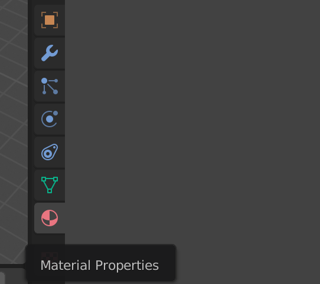
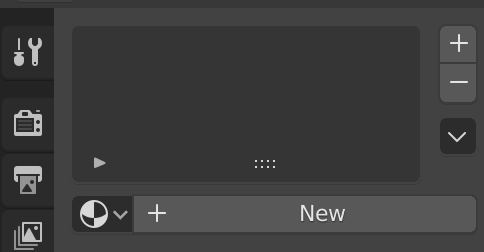

## Colour the rocket

First we will give the rocket a basic blue colour.

+ Select the rocket.

+ Go to the **Material** tab on the right menu panel.

+ Add a new material by clicking **New**.

+ Call the material `blue`.

+ Select a blue color from the **Diffuse** menu to colour your rocket blue.

