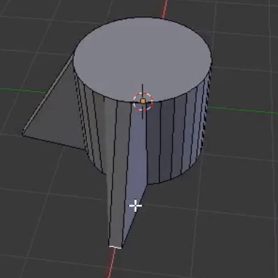

## Η βάση του πυραύλου

+ Άνοιξε το Blender και βγες από την οθόνη εκκίνησης.

+ Ξεκίνησε επιλέγοντας τον κύβο, κατόπιν πάτα <kbd>Χ</kbd> για να τον διαγράψεις.

+ Πήγαινε στην εργαλειοθήκη και κάνε κλικ στην καρτέλα **Create**. Πρόσθεσε έναν κύλινδρο.

Θα δημιουργήσουμε τον πύραυλο απ' αυτόν τον κύλινδρο. Ο κύλινδρος θα αποτελεί τη βάση του πυραύλου και θα προσθέτουμε από πάνω του νέα αντικείμενα προκειμένου να κατασκευάσουμε τον πύραυλο.

+ Πήγαινε στη λειτουργία **Edit Mode** χρησιμοποιώντας το μενού στο κάτω μέρος.

Ας δημιουργήσουμε τα πτερύγια που σταθεροποιούν τον πύραυλο καθώς πετάει.

+ Κάνε κλικ στο **Edge select** στο κάτω μενού.

+ Κάνε δεξί κλικ σε μια ακμή στη βάση του κυλίνδρου για να την επιλέξεις.

+ Κάνε κλικ και σύρε την άκρη προς τα έξω χρησιμοποιώντας τα έγχρωμα βέλη προκειμένου να δημιουργήσεις ένα πτερύγιο.

+ Δημιούργησε τέσσερα πτερύγια.

Now you have the base of your rocket!