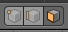
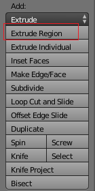
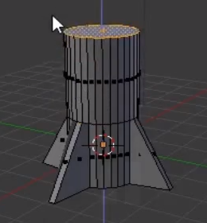
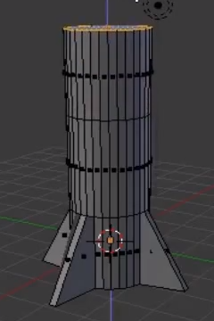

## Το σώμα του πυραύλου

Τώρα ας δημιουργήσουμε το σώμα του πυραύλου.

+ Πήγαινε στο εργαλείο **Face select**.

+ Κάνε δεξί κλικ για να επιλέξεις την πάνω όψη του κυλίνδρου.

Άν την τραβήξεις προς τα πάνω φαίνεται λίγο περίεργη. Όλα θα τραβηχτούν προς τα πάνω και αυτό είναι κάτι που δεν θέλεις.

Με <kbd>CTRL + Z</kbd> ακυρώνεις τυχόν αλλαγές που έκανες.

Αντ' αυτού θα εξωθήσουμε αυτή την περιοχή.

+ Πήγαινε στην εργαλειοθήκη, επίλεξε την καρτέλα **Tools** και κατόπιν επίλεξε **Extrude region**.

+ Τράβηξε το τμήμα προς τα πάνω για να δημιουργήσεις ένα ψηλότερο πύραυλο και μετά κάνε κλικ όταν θα είσαι ευχαριστημένος με το αποτέλεσμα.

+ Εξώθησε πάλι το ίδιο τμήμα προς τα πάνω για να δημιουργήσεις τη βάση της κωνικής κορφής του πυραύλου. Είτε επιλέγοντας **Extrude region** από το μενού ξανά είτε, αν προτιμάς, χρησιμοποιώντας το πλήκτρο συντόμευσης <kbd>E</kbd>.

