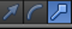
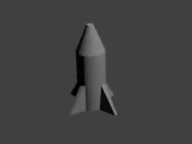

## Κωνική κορυφή

Η κωνική κορυφή πρέπει να καταλήγει σ' ένα σημείο. Για να το πετύχεις αυτό μπορείς να χρησιμοποιήσεις το εργαλείο αλλαγής μεγέθους.

+ Επίλεξε το εργαλείο **cube end**.

+ Άλλαξε το μέγεθος της περιοχής χρησιμοποιώντας τις κόκκινες και πράσινες λαβές, μετατρέποντάς το σε κωνική κορυφή.

 

+ Δημιούργησε την εικόνα πατώντας <kbd>F12</kbd> (<kbd>FN + F12</kbd> αν χρησιμοποιείς Mac) για να δεις πώς θα φαίνεται ο πύραυλός σου.

Μπορεί να φαίνεται λίγο μεγάλος, αλλά μπορείς να αλλάξεις το μέγεθος ολόκληρου του πυραύλου.

+ Πάτησε <kbd>ESC</kbd> για να βγεις από την προβολή εμφάνισης.

+ Πήγαινε στη λειτουργία **Object Mode** χρησιμοποιώντας το μενού στο κάτω μέρος.

+ Πάτα το πλήκτρο <kbd>S</kbd> για αλλαγή μεγέθους και κατόπιν συρρίκνωσε τον πύραυλο. Κάνε κλικ όταν θα είσαι ικανοποιημένος με το μέγεθος.

+ Εκτέλεσε ξανά την ιδια ενέργεια πατώντας <kbd>F12</kbd> (or <kbd>FN + F12</kbd>) για να επιβεβαιώσεις πως ο πύραυλος έχει το σωστό μέγεθος.

