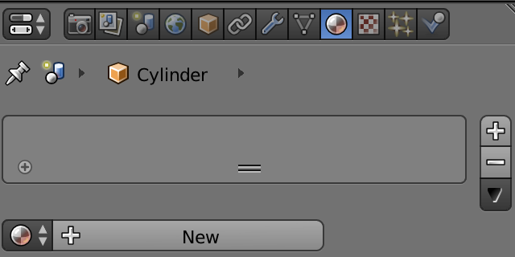

## Χρωμάτισε τον πύραυλο

Πρώτα θα δώσουμε στον πυραύλο ένα βασικό μπλε χρώμα.

+ Επίλεξε τον πύραυλο.

+ Πήγαινε στην καρτέλα **Material** στο δεξιό μενού.

+ Πρόσθεσε νέο υλικό κλικάροντας στο **New**.

+ Ονόμασε το υλικό `blue`.

+ Επίλεξε ένα μπλε χρώμα από το μενού **Diffuse** για να χρωματίσεις τον πύραυλο μπλε.

