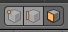

## Πρόσθεσε λωρίδες

+ Βεβαιώσου οτι ο πύραυλος είναι επιλεγμένος και κατόπιν επίλεξε **Edit Mode** από το κάτω μενού. Αν προτιμάς, χρησιμοποίησε το πλήκτρο <kbd>Tab</kbd> ως συντόμευση.

+ Κάνε κλικ στο εργαλείο **Face select** από το κάτω μενού.

Τώρα θα προσθέσουμε ένα νέο υλικό για τις λωρίδες.

+ Πήγαινε στην καρτέλα **Material** στο δεξιό μενού και πρόσθεσε ένα νέο υλικό κάνοντας κλικ στο εικονίδιο **+**.

+ Κάνε κλικ στο **New** και ονόμασε το υλικό `white`.

+ Επίλεξε ένα λευκό χρώμα για το μενού **Diffuse**.

Τώρα μπορείς να προσθέσεις αυτό το χρώμα στις λωρίδες του πυραύλου σου.

+ Κάνε δεξί κλικ για να επιλέξεις μια λωρίδα πάνω στον πύραυλο που θες να χρωματίσεις λευκή.

+ Κάνε κλικ στο υλικό white και μετά κλικ στο κουμπί **Assign** για να βάψεις τη λωρίδα λευκή.

Τώρα επίλεξε την επόμενη λωρίδα που θες να χρωματιστεί και δώσε της λευκό χρώμα επαναλαμβάνοντας τα προηγούμενα βήματα. Μπορείς να επιλέξεις πολλές λωρίδες ταυτόχρονα επιλέγοντας μια και κατόπιν κρατώντας πατημένο το πλήκτρο <kbd>Shift</kbd> επιλέγεις και τις υπόλοιπες.

+ Εκτέλεσε τον σχεδιασμό του πυραύλου για να δεις πώς θα φαίνεται.