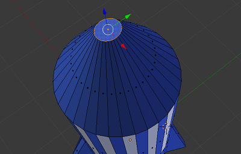
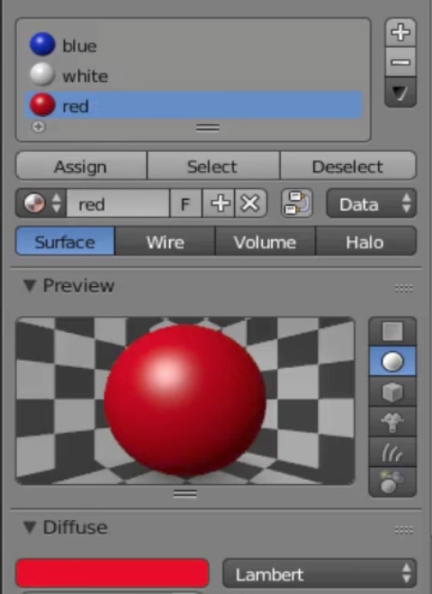
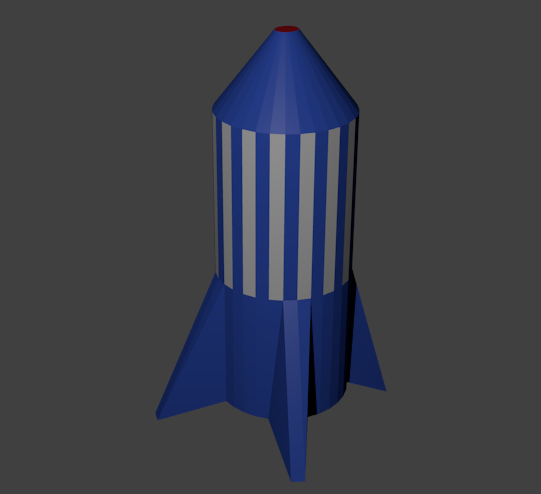

## Κόκκινη κορυφή

Ας χρωματίσουμε την κορυφή κόκκινη.

+ Κάνε δεξί κλικ για να επιλέξεις την κορυφή.

+ Πρόσθεσε νέο υλικό με την ονομασία `red` και επίλεξε ένα κόκκινο χρώμα για το μενού **Diffuse**.

+ Εκχώρησε το κόκκινο υλικό στην κορυφή με το Assign.

+ Εκτέλεσε τον σχεδιασμό για να δεις να εμφανίζεται ένας μπλε πύραυλος με λευκές λωρίδες και κόκκινη κορυφή.

