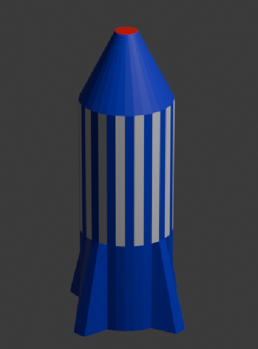

## What you will make

Here is how your finished piece will look:

--- print-only ---

--- /print-only ---

--- no-print ---

  <iframe class="responsive-embed__iframe" src="https://sketchfab.com/models/d701ca4a53e2426d8ebffe9c8baa9f15/embed" frameborder="0" allowvr allowfullscreen mozallowfullscreen="true" webkitallowfullscreen="true"></iframe>

--- /no-print ---

### You will need

+ A desktop or laptop computer capable of running the Blender software

+ [Blender](https://www.blender.org/download/){:target="_blank"} (v2.8 or newer)
