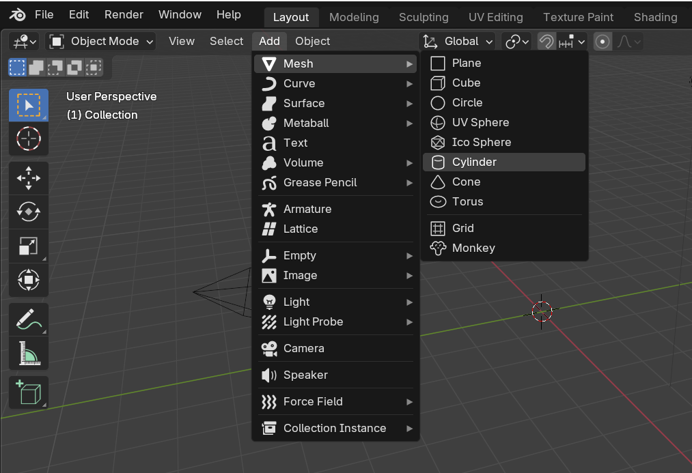
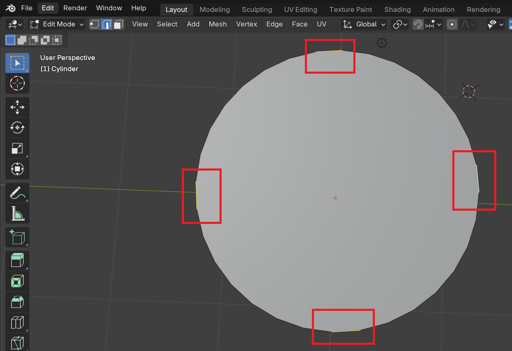
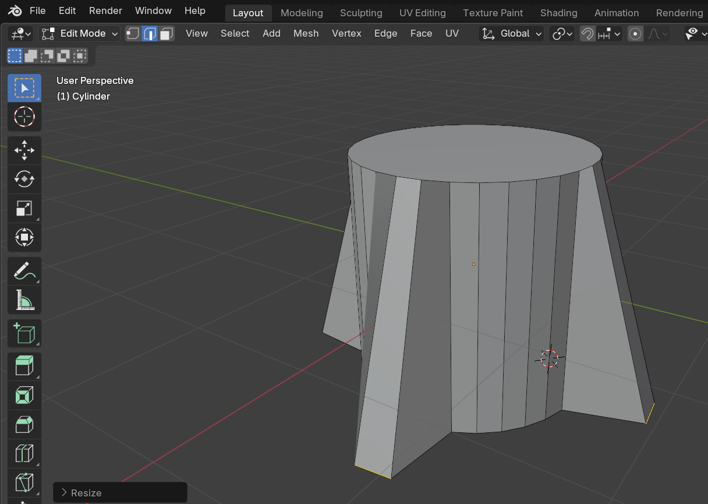

## Base of the rocket

--- task ---

Open Blender and exit the splash screen.

--- /task ---

--- task ---

Select the cube and press the <kbd>X</kbd> or <kbd>delete</kbd> key to delete it.

--- /task ---

--- task ---

Go to the **Add** dropdown menu. Add a cylinder from the Mesh section.

--- /task ---

**Note**: Your cylinder will not sit on the floor (the 'Y' plane). 
Don't worry about that!

The cylinder will be the bottom of the rocket. 

You will add to the top of it to build up the rocket.  

--- task ---

Switch to **Edit Mode** using the menu on the top left.

--- /task ---

Create the fins that stabilize the rocket as it flies.

--- task ---

Click on **Edge select** in the lower menu.

--- /task ---

--- task ---

Rotate your view so you are viewing the base of the rocket.

--- /task ---

--- task ---

Select four edges at the base of the cylinder that are parallel and perpendicular to each other. 

Hold <kbd>Shift</kbd> while clicking to select more than one side.

You can see the selected edges highlighted by red boxes in this image:

--- /task ---

--- task ---

Press <kbd>S</kbd> and move your mouse to drag out the edges and press <kbd>Enter</kbd> to finish.

--- /task ---

Now you have the base of your rocket!
