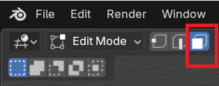
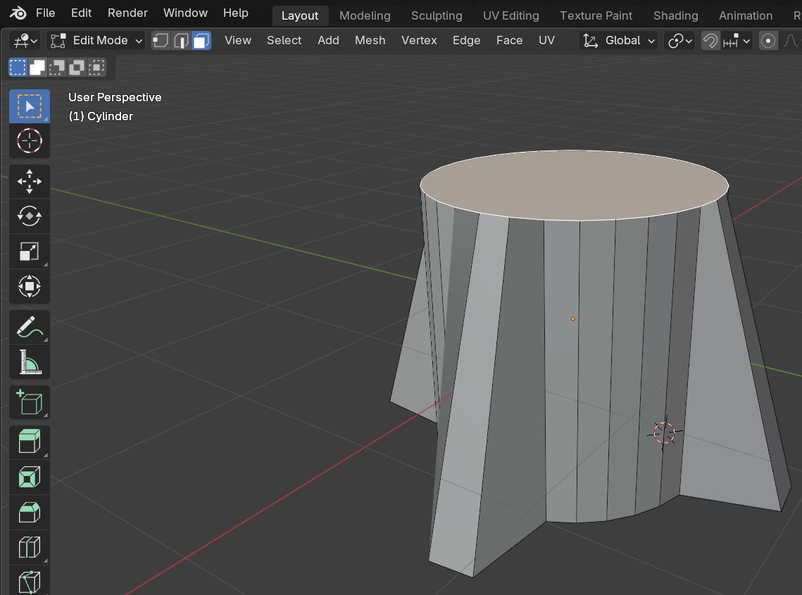
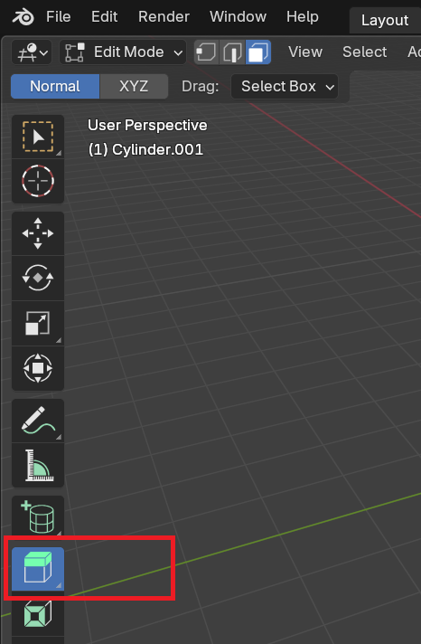
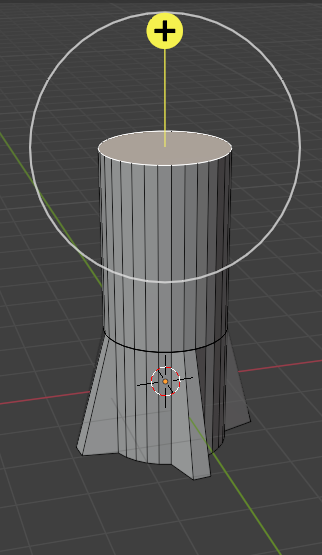
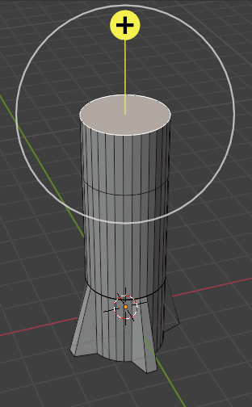

## Body of the rocket

--- task ---

Switch to the **Face select** tool.

--- /task ---

--- task ---

Click to select the top face of the cylinder.

--- /task ---

You need to 'extrude' this face.

--- task ---

Select **Extrude region** from the list of tools on the left.

--- /task ---

--- task ---

Pull the section up to create a taller rocket using the yellow `+`.

--- /task ---

--- task ---

Extrude the same face once more to form the basis of the nose cone.

--- /task ---

--- save ---
