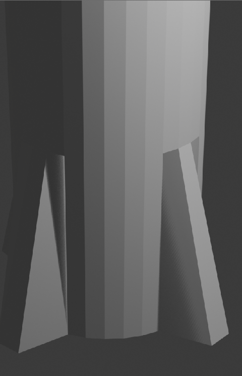

## Nose cone

The nose cone should come to a point. To do this you can use the resize tool.

--- task ---

Make sure you have the top face selected.

--- /task ---

--- task ---

Resize the face by pressing <kbd>S</kbd> and moving your mouse, turning it into more of a nose cone shape. Click when you have the shape that you want.

--- /task ---

--- task ---

Render the image by clicking 'Render Image' in the 'Render' menu and see what the rocket looks like.

**Note**: This may take some time.

--- /task ---

It might look a bit big, but you can resize the whole rocket.

--- task ---

Press <kbd>ESC</kbd> to exit the render view.

Switch back to **Object Mode** using the menu at the top left and select the rocket by clicking on it.

--- /task ---

--- task ---

Press the <kbd>S</kbd> key to resize, then shrink the rocket. Click when you are happy with the size.

--- /task ---

--- task ---

Render again.

You may want to do this a few times to confirm the rocket has the right size.

--- /task ---

--- task ---

Press <kbd>ESC</kbd> to exit the render view.

--- /task ---

--- save ---