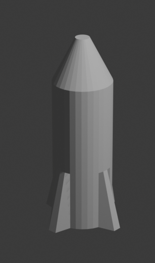

## Nose cone

The nose cone should come to a point. To do this you can use the resize tool.

+ Select the top face of the rocket again.

+ Resize the face by pressing <kbd>S</kbd> and moving your mouse, turning it into more of a nose cone shape. Click when you have the shape that you want.

+ Render the image by pressing <kbd>F12</kbd> (<kbd>FN + F12</kbd> if you're using a Mac) and see what the rocket looks like.

It might look a bit big, but you can resize the whole rocket.

+ Press <kbd>ESC</kbd> to exit the render view.

+ Switch back to **Object Mode** using the menu at the top left and select the rocket by clicking on it.

+ Press the <kbd>S</kbd> key to resize, then shrink the rocket. Click when you are happy with the size.

+ Render again by pressing <kbd>F12</kbd> (or <kbd>FN + F12</kbd>) to confirm the rocket has the right size.

