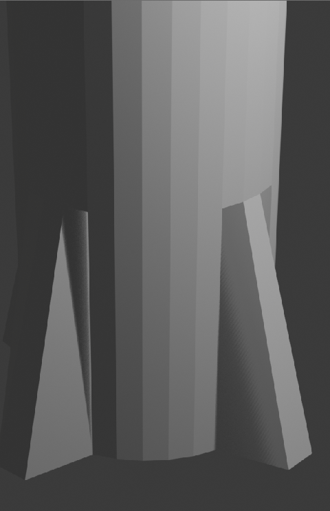
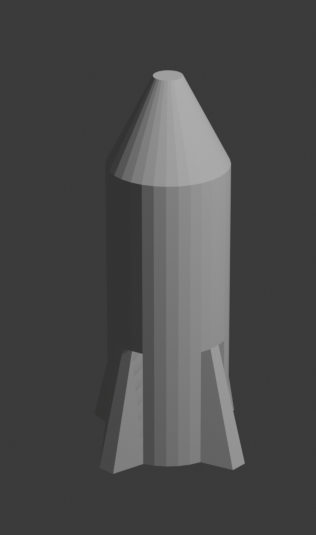

## Nose cone

The nose cone should come into a point. To do this you can use the resize tool.

+ Select the cube end tool

+ Resize the face using the red and green handles, turning it into more of a nose cone.

+ Render the image by pressing <kbd>F12</kbd> (<kbd>FN + F12</kbd> if on a Mac) and see what the image looks like.

The rocket might look a bit big, but you can resize the whole rocket.

+ Press <kbd>ESC</kbd> to exit the render view.

+ Switch back to **Object mode** using the menu at the bottom.

+ Press the S key to resize, then shrink the rocket. Click when you are happy with the size.

+ Render again by pressing <kbd>F12</kbd> (or <kbd>FN + F12</kbd>.)

