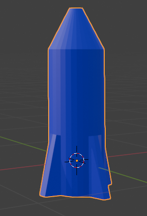

## Colour the rocket

Give the rocket a basic blue colour.

--- task ---

Go to the **Material Properties** tab on the right menu panel.

You might need to scroll the menu down to see it.

--- /task ---

--- task ---

Add a new material by clicking **New**.

--- /task ---

--- task ---

Name the material `blue`.

--- /task ---

--- task ---

Select a blue color from the **Base Color** menu to colour your rocket blue.

--- /task ---

--- task ---

Select the 'Material Preview' option from the Viewport Shading options to see your rocket with the blue material.

--- /task ---

--- save ---