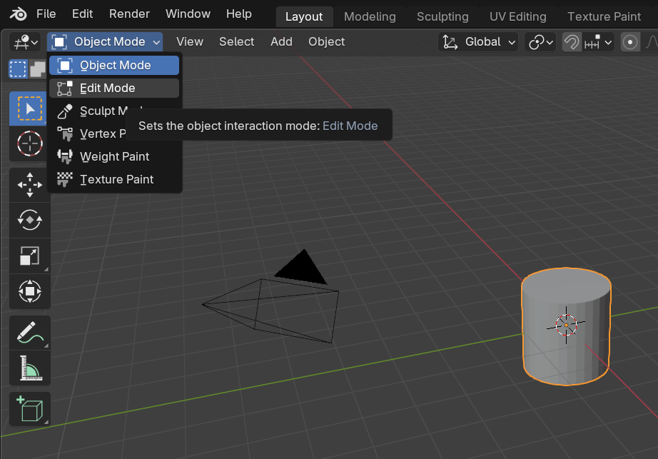
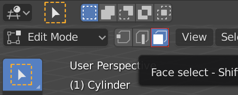
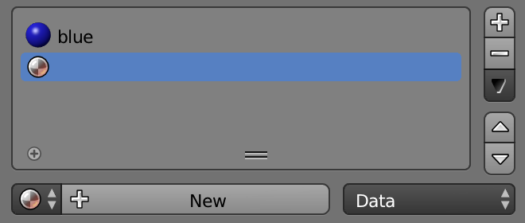
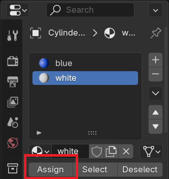
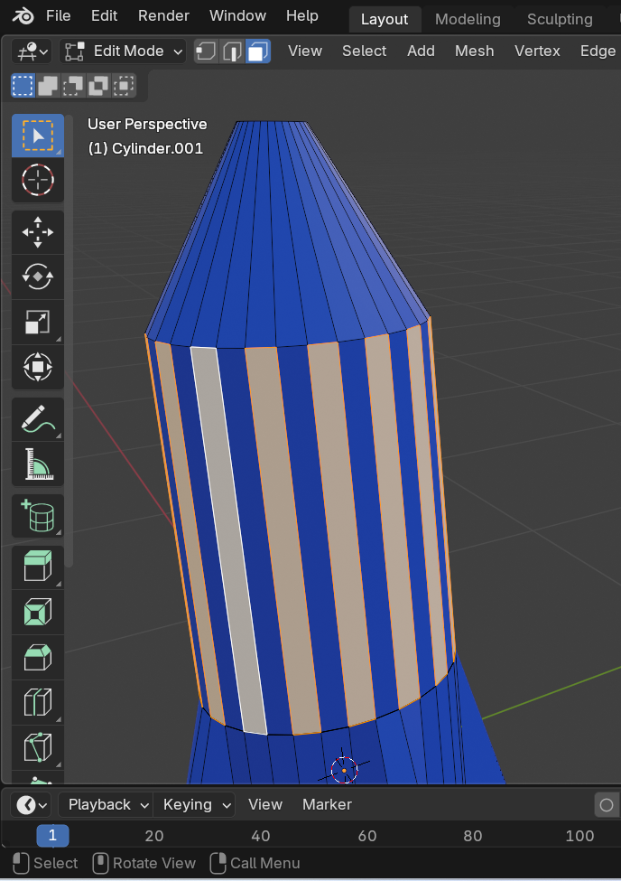

## Add stripes

--- task ---

Make sure the rocket is selected, then select **Edit Mode** from the menu in the top left corner. If you prefer, you can use the <kbd>Tab</kbd> key as a shortcut.

--- /task ---

--- task ---

Make sure the **Face select** tool is selected from the menu next to the edit mode menu.

--- /task ---

### Add a new material for the stripes.

--- task ---

Go to the **Material Properties** tab on the right menu panel, and add another new material by clicking the **+** icon.

--- /task ---

--- task ---

Click on **New** and name the material `white`.

--- /task ---
 
--- task ---

Select a white colour for the **Base Color** menu

--- /task ---

### Add your colour to the rocket **faces**.

--- task ---

Select a face on the rocket that you want to colour white.

--- /task ---

--- task ---

Click on the white material, then click on the **Assign** button to colour the face white.

--- /task ---

--- task ---

Select the next face to be coloured white and 'assign' your new white material to it. 

--- /task ---

You can select multiple faces at once by selecting a face and then holding <kbd>Shift</kbd> while selecting the other faces.

--- task ---

Render your rocket to see what it looks like.

--- /task ---

--- save ---
