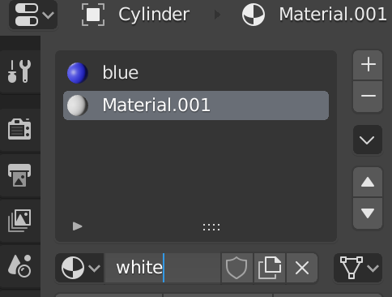

## Add stripes

+ Make sure the rocket is selected, then select **Edit Mode** from the menu in the top left corner. If you prefer, you can use the <kbd>Tab</kbd> key as a shortcut.

+ Click on the **Face select** tool from the menu next to the edit mode menu.

Now we will add a new material for the stripes.

+ Go to the **Material Properties** tab on the right menu panel, and add another new material by clicking the **+** icon.

+ Click on **New** and call the material `white`.

+ Select a white colour for the **Base Color** menu.

Now you can add this colour to the faces of the rocket.

+ Click to select a face on the rocket that you want to colour white.

+ Click on the white material, then click on the **Assign** button to colour the face white.

Now select the next face to be coloured and give it the white colour by repeating the previous steps. You can select multiple faces at once by selecting a face and then holding <kbd>Shift</kbd> while selecting the other faces.

+ Render your rocket to see what it looks like.
