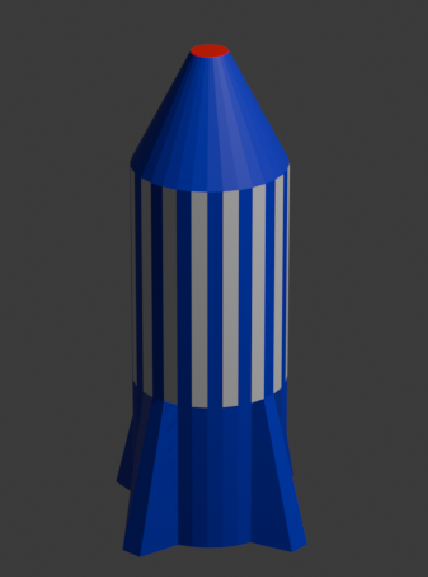

## Challenge

Can you add more colours to your rocket? 

Perhaps you could make the nose red?

--- task ---

Click to select the face of the nose.

--- /task ---

--- task ---

Add a new material called `red` and select a red colour for the **Base Color** menu.

--- /task ---

--- task ---

Assign the red material to the nose.

--- /task ---

--- task ---

Render to see your blue rocket with white stripes and a red nose.

--- /task ---

Can you add another new material for a different colour and add it to the fins?
