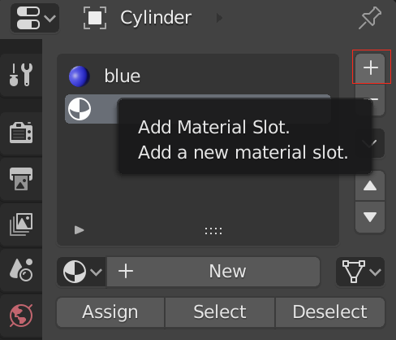

## Add stripes

+ Make sure the rocket is selected, then select **Edit mode** from the lower menu. If you prefer, you can use the <kbd>Tab</kbd> key as a shortcut.

+ Select the Face tool from the lower menu.

Now we will add a new material for the stripes.

+ Go to the **Material** tab on the right menu panel, and add another new material by pressing the + button.

+ Click on New and call the material **white**.

+ Select a white colour for the Diffuse.

Now you can add this colour to the faces of the rocket.

+ Right click to select a face on the rocket that you want to colour white.

+ Click on the white material, then click on the **Assign** button to colour the face white.

Now select the next face to be coloured and give it the white colour by repeating the previous steps. You can select multiple faces at once by selecting a face then holding <kbd>Shift</kbd> while selecting the other faces.

+ Press <kbd>F12</kbd> to see your image.
