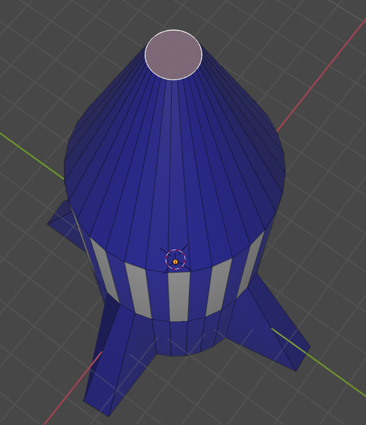
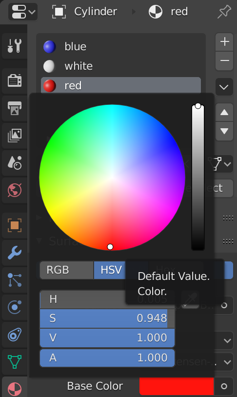

## Red nose

Let's colour the nose red.

+ Right click to select the face of the nose.

+ Add a new material called **red** and select a red colour for the Diffuse.

+ Assign the red material to the nose.

+ Render or press <kbd>F12</kbd> to see your blue rocket with white stripes and a red nose.

