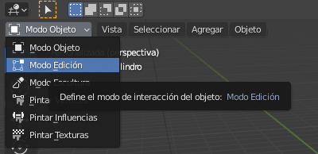
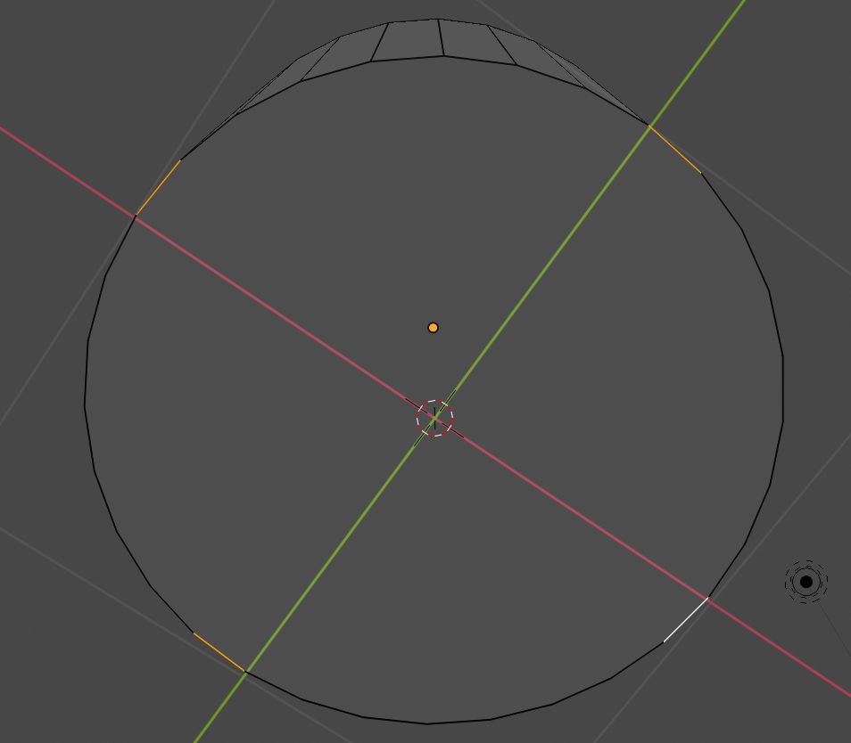

## Base del cohete

+ Abre Blender y cierra la pantalla de bienvenida.

+ Comienza seleccionando el cubo y presiona <kbd>X</kbd> para eliminarlo.

+ Ve al menú desplegable **Añadir**. Agrega un cilindro de la sección Malla.

Crearemos el cohete a partir de este cilindro. El cilindro será la base del cohete, y agregaremos a la parte superior de él para construir el cohete.

+ Cambia a **Modo de edición** usando el menú de la parte superior izquierda.

Vamos a crear las aletas que estabilizan el cohete mientras vuela.

+ Haz clic en **Selección de bordes** en el menú inferior.

+ Selecciona 4 aristas en la base del cilindro que sean paralelas y perpendiculares entre sí. Mantén pulsado <kbd>Shift</kbd> mientras haces clic para seleccionar más de un lado.

+ Pulsa <kbd>S</kbd> y mueve el ratón para arrastrar los bordes y pulsa <kbd>Enter</kbd> para terminar.

¡Ahora tienes la base de tu cohete!