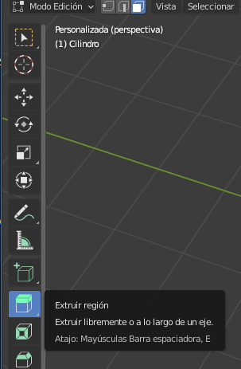

## Cuerpo del cohete

Ahora vamos a crear el cuerpo del cohete.

+ Cambia a la herramienta **de selección de cara.**.

+ Haz clic para seleccionar la cara superior del cilindro.

Si lo levantas, se ve un poco extraño. Todo se moverá hacia arriba, y eso no es lo que quieres.

Puedes presionar <kbd>CTRL + Z</kbd> para deshacer cualquier cambio que hayas realizado.

En cambio, extruiremos esta cara.

+ Selecciona **Extruir región** de la lista de herramientas a la izquierda, o si lo prefieres, usa la tecla de acceso directo <kbd>E</kbd>.

+ Arrastra la sección para crear un cohete más alto usando el `+`, luego haz clic cuando estés satisfecho.

+ Extruye la misma cara una vez más para formar la base del cono de la nariz. Selecciona nuevamente **Extruir region** en el menú, o si lo prefieres, usa el acceso directo <kbd>E</kbd>.

