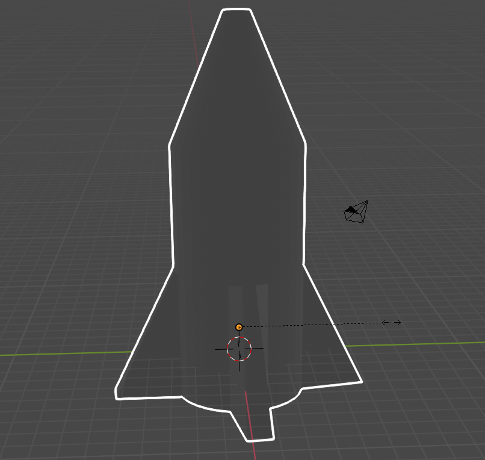
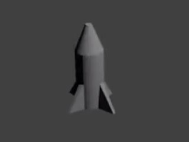

## Cono de la nariz

El cono de la nariz debe terminar en un punto. Para hacer esto puedes utilizar la herramienta redimensionar.

+ Selecciona la cara superior del cohete nuevamente.

+ Cambia el tamaño de la cara pulsando <kbd>S</kbd> y moviendo el ratón, convirtiéndola en una forma más parecida al cono de nariz. Haz clic cuando tengas la forma que te guste.

+ Renderiza la imagen pulsando <kbd>F12</kbd> (<kbd>FN + F12</kbd> si estás usando un Mac) y ve cómo se ve el cohete.

Puede parecer un poco grande, pero puedes cambiar el tamaño de todo el cohete.

+ Presiona <kbd>ESC</kbd> para salir de la vista de renderizado.

+ Cambia de vuelta a **Modo objeto** usando el menú en la parte superior izquierda y selecciona el cohete haciendo clic en él.

+ Pulsa la tecla <kbd>S</kbd> para cambiar el tamaño, y luego reduce el cohete. Haz clic cuando estés satisfecho con el tamaño.

+ Renderiza nuevamente presionando <kbd> F12 </kbd> (o <kbd>FN + F12</kbd>) para confirmar que el cohete tiene el tamaño correcto.

