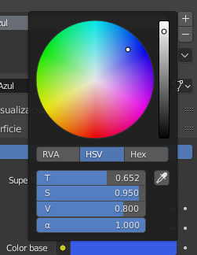

## Colorea el cohete

Primero le daremos al cohete un color azul básico.

+ Selecciona el cohete.

+ Ve a la pestaña **Propiedades de materiales** en el panel de la derecha del menú.

+ Agrega un nuevo material haciendo clic en el botón **Nuevo**.

+ Nombra al material `azul`.

+ Selecciona un color azul en el menú **Color base** para colorear tu cohete de azul.

