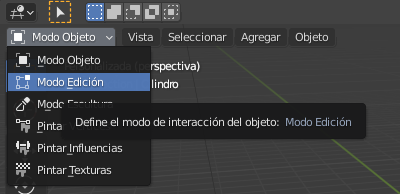
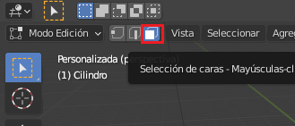
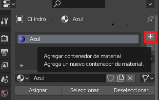
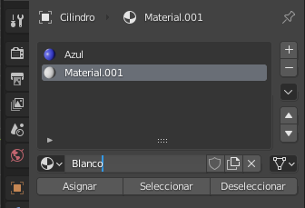
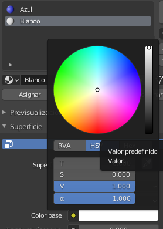
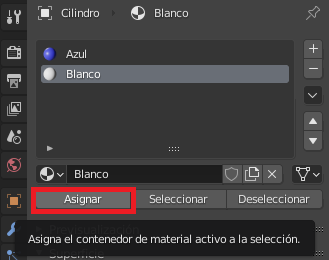
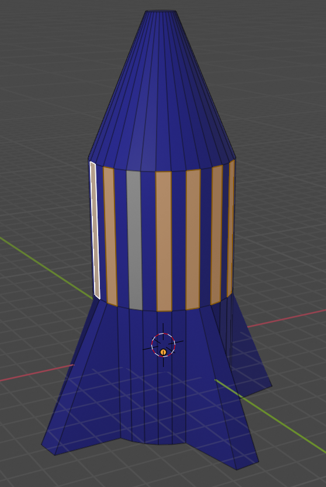

## Añadir rayas

+ Asegúrate de que el cohete está seleccionado, luego selecciona **Modo de edición** del menú en la esquina superior izquierda. Si lo prefieres, puedes usar la tecla <kbd>Tabulador</kbd> como acceso directo.

+ Haz clic en la herramienta **Seleccionar cara** del menú al lado del menú modo de edición.

Ahora vamos a añadir un nuevo material para las rayas.

+ Ve a la pestaña **Propiedades de Material** en el panel del menú derecho y añada otro nuevo material haciendo clic en el ícono **+**.

+ Haz clic en **Nuevo** y nombra al material `blanco`.

+ Selecciona un color blanco en el menú **Color base**.

Ahora puedes añadir este color a las caras del cohete.

+ Haz clic para seleccionar una cara en el cohete que quieras colorear de blanco.

+ Haz clic en el material blanco, luego haz clic en el botón **Asignar** para colorear la cara blanca.

Ahora selecciona la cara siguiente a colorear y dale el color blanco repitiendo los pasos anteriores. Puedes seleccionar múltiples caras a la vez seleccionando una cara y luego manteniendo <kbd>Shift</kbd> apretado mientras seleccionas las otras caras.

+ Renderiza tu cohete para ver cómo se ve.