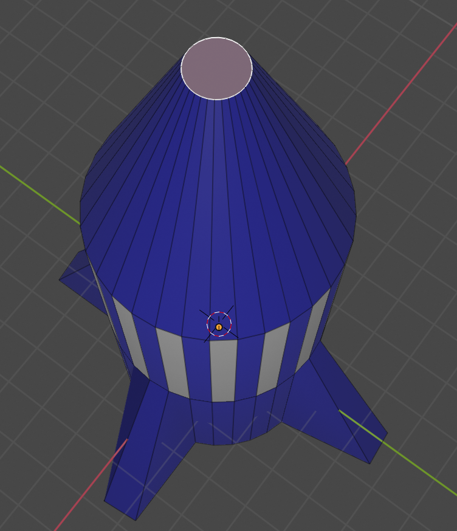
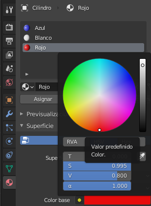
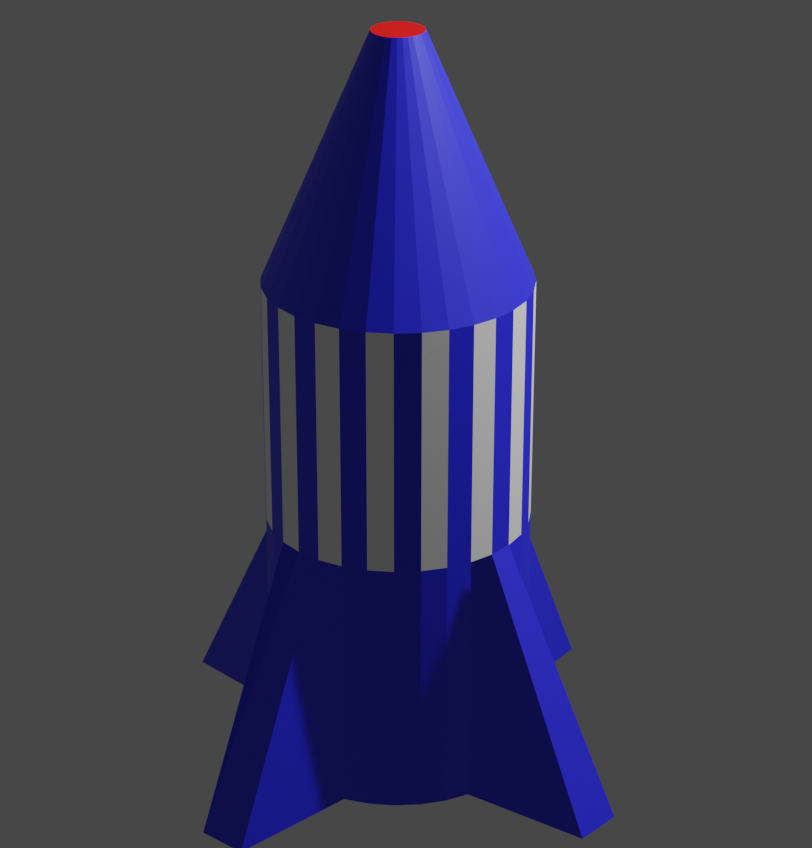

## Nariz roja

Pintemos la nariz de rojo.

+ Haga clic para seleccionar la cara de la nariz.

+ Añade un nuevo material llamado `Rojo` y selecciona un color rojo del menú **Color base**.

+ Asigna el material rojo a la nariz.

+ Renderiza para ver tu cohete azul con rayas blancas y una nariz roja.

