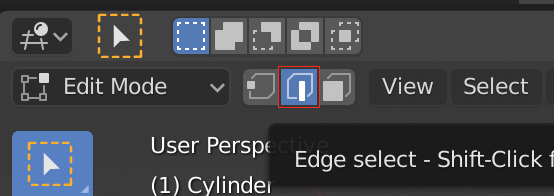
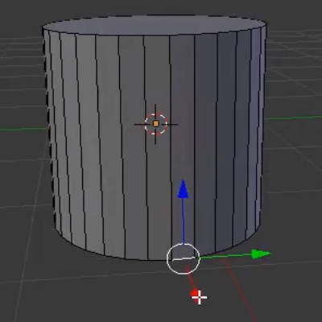
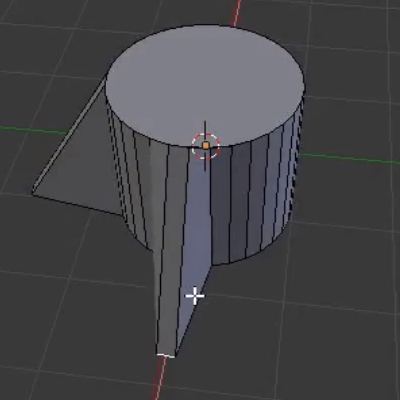
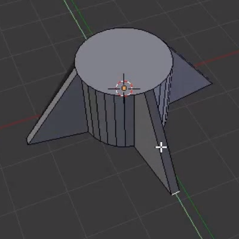

## रॉकेट का आधार

+ Blender (ब्लेंडर) खोलें और स्प्लैश स्क्रीन से बाहर निकलें।

+ क्यूब का चयन करके आरंभ करें, फिर उसे हटाने के लिए <kbd>X</kbd> दबाएँ।

+ टूलबॉक्स पर जाएँ, और **Create** टैब पर क्लिक करें। एक सिलेंडर जोड़ें।

हम इस सिलेंडर से रॉकेट बनाएँगे। सिलेंडर रॉकेट का निचला हिस्सा होगा, और हम रॉकेट बनाने के लिए इसके ऊपर के हिस्से पर कुछ जोड़ेंगे।

+ नीचे दिए गए मेनू का उपयोग करते हुए **Edit Mode** में जाएँ।

आइए उन पंखों को तैयार करते हैं जो रॉकेट को उड़ते समय स्थिरता प्रदान करते हैं।

+ नीचे के मेनू में **Edge select** पर क्लिक करें।

+ इसे चुनने के लिए सिलेंडर के आधार पर किसी किनारे पर राइट-क्लिक करें।

+ पंख बनाने के लिए रंगीन तीरों का उपयोग करके किनारे पर क्लिक करें और खींचें।

+ चार पंख बनाएँ

Now you have the base of your rocket!