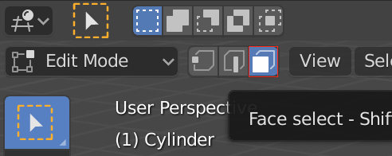
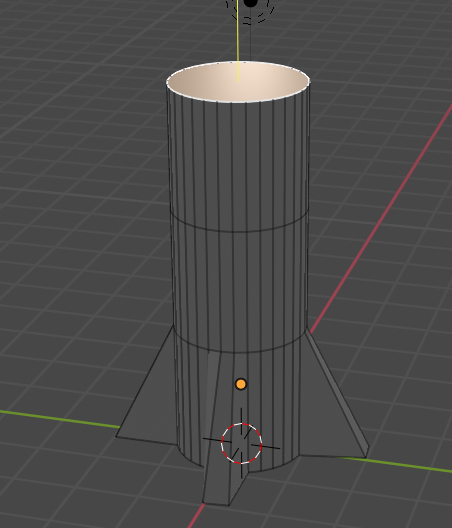

## रॉकेट की बॉडी

अब राकेट का शरीर बनाते हैं।

+ **Face select** टूल पर जाएँ।

+ सिलेंडर की ऊपर की आकृति का चयन करने के लिए क्लिक करें।

यदि आप इसे ऊपर खींचते हैं, तो यह थोड़ा अजीब लगता है। हर चीज़ ऊपर चली जाएगी, और यह वह नहीं है जो आप चाहते हैं।

आपके द्वारा किए गए किन्हीं भी परिवर्तनों को पूर्ववत् करने के लिए आप </kbd>CTRL + Z<kbd> दबा सकते हैं।
 

इसके बजाय, हम इस आकृति को बाहर निकालेंगे।

+ या तो मेनू से फिर से <strong>Extrude region</strong> का चयन करें, या यदि आप चाहें, तो शॉर्टकट कुंजी <kbd>E</kbd> का उपयोग करें।

+ `+` का उपयोग करके एक लंबा रॉकेट बनाने के लिए अनुभाग को ऊपर खींचें, तब क्लिक करें जब आप खुश हों।

+ नाक के शंकु के आधार तैयार करने के लिए उसी आकृति को एक बार फिर बाहर निकालें। या तो मेनू से फिर से <strong>Extrude region</strong> का चयन करें, या यदि आप चाहें, तो शॉर्टकट कुंजी <kbd>E</kbd> का उपयोग करें।

