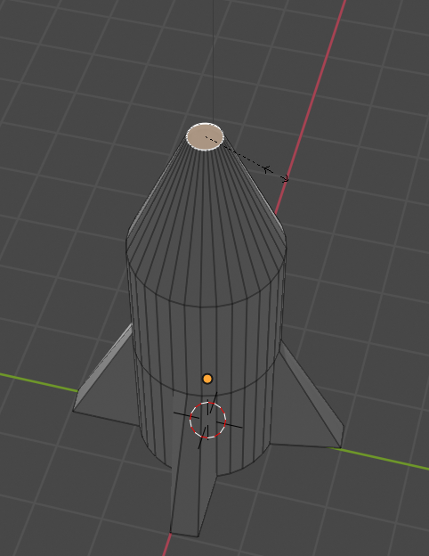
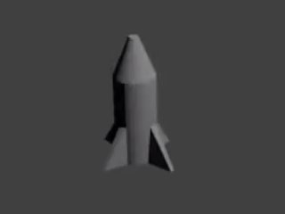

## नाक शंकु

नाक शंकु एक बिंदु पर आना चाहिए। ऐसा करने के लिए आप आकार बदलने के टूल का उपयोग कर सकते हैं।

+ रॉकेट के शीर्ष चेहरे को फिर से चुनें।

+ <kbd>S दबाकर चेहरे का आकार बदलें</kbd> और अपने माउस को घुमाते हुए, इसे नाक के शंकु के आकार में बदल दें। जब आप चाहते हैं कि आकार है पर क्लिक करें।

+ <kbd>F12</kbd> दबाकर (या यदि आप मैक का उपयोग कर रहे हैं तो <kbd>FN + F12</kbd> दबाकर) छवि प्रस्तुत करें और देखें कि रॉकेट कैसा दिखता है।

यह थोड़ा बड़ा लग सकता है, लेकिन आप पूरे रॉकेट का आकार बदल सकते हैं।

+ प्रस्तुत दृश्य से बाहर निकलने के लिए <kbd>ESC</kbd> दबाएँ।

+ **ऑब्जेक्ट मोड पर वापस जाएं** शीर्ष बाईं ओर स्थित मेनू का उपयोग करके और उस पर क्लिक करके रॉकेट का चयन करें।

+ आकार बदलने के लिए <kbd>S</kbd> कुंजी दबाएँ, फिर रॉकेट को थोड़ा छोटा करें। जब आप आकार से संतुष्ट हों तो क्लिक करें।

+ यह पुष्टि करने के लिए कि रॉकेट का आकार सही है <kbd>F12</kbd> (या <kbd>FN + F12</kbd>) दबाकर फिर से प्रस्तुत करें।

