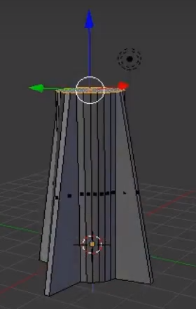
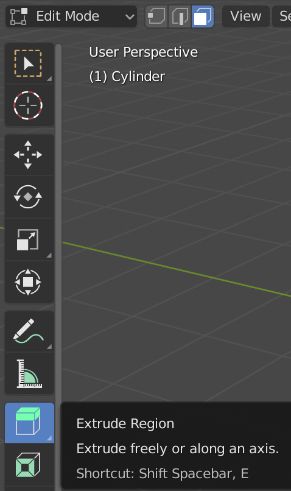

## रॉकेट की बॉडी

आइए अब रॉकेट की बॉडी बनाते हैं।

+ **Face select** टूल पर जाएँ।

+ सिलेंडर की ऊपर की आकृति का चयन करने के लिए राइट-क्लिक करें।

यदि आप इसे ऊपर खींचते हैं, तो यह थोड़ा अजीब लगता है। हर चीज़ ऊपर चली जाएगी, और यह वह नहीं है जो आप चाहते हैं।

आपके द्वारा किए गए किन्हीं भी परिवर्तनों को पूर्ववत् करने के लिए आप </kbd>CTRL + Z<kbd> दबा सकते हैं।
 

  इसके बजाय, हम इस आकृति को बाहर निकालेंगे।

<ul>
  <li>
    टूलबॉक्स पर जाएँ, <strong>Tools</strong> टैब का चयन करें, फिर <strong>Extrude region</strong> का चयन करें।
  </li>
</ul>

  

<ul>
  <li>
    अधिक लंबा रॉकेट बनाने के लिए इस हिस्से को खींच कर ऊपर ले जाएँ, फिर जब आप संतुष्ट हों तो क्लिक करें।
  </li>
</ul>

  

<ul>
  <li>
    नाक के शंकु के आधार तैयार करने के लिए उसी आकृति को एक बार फिर बाहर निकालें। या तो मेनू से फिर से <strong>Extrude region</strong> का चयन करें, या यदि आप चाहें, तो शॉर्टकट कुंजी <kbd>E</kbd> का उपयोग करें।
  </li>
</ul>

  

