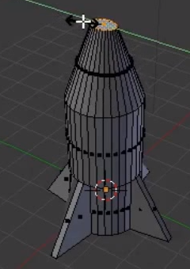

## नाक शंकु

नाक शंकु किसी बिंदु पर आना चाहिए। ऐसा करने के लिए आप आकार बदलने के टूल का उपयोग कर सकते हैं।

+ **cube end** टूल का चयन करें।

+ लाल और हरे रंग के हैंडल का उपयोग करके आकृति का आकार बदलें, इसे जितना अधिक हो सके नाक शंकु के आकार में बदल दें।

+ <kbd>F12</kbd> दबाकर (या यदि आप मैक का उपयोग कर रहे हैं तो <kbd>FN + F12</kbd> दबाकर) छवि प्रस्तुत करें और देखें कि रॉकेट कैसा दिखता है।

It might look a bit big, but you can resize the whole rocket.

+ प्रस्तुत दृश्य से बाहर निकलने के लिए <kbd>ESC</kbd> दबाएँ।

+ नीचे दिए गए मेनू का उपयोग करते हुए **Object Mode** में वापस जाएंँ।

+ आकार बदलने के लिए <kbd>S</kbd> कुंजी दबाएँ, फिर रॉकेट को थोड़ा छोटा करें। जब आप आकार से संतुष्ट हों तो क्लिक करें।

+ यह पुष्टि करने के लिए कि रॉकेट का आकार सही है <kbd>F12</kbd> (या <kbd>FN + F12</kbd>) दबाकर फिर से प्रस्तुत करें।

