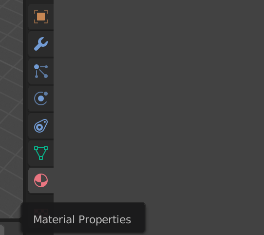

## रॉकेट में रंग भरें

सबसे पहले हम रॉकेट को एक मूल नीला रंग देंगे।

+ रॉकेट का चयन करें।

+ दाएँ मेनू पैनल पर **Material Properties** (सामग्री) टैब पर जाएँ।

+ **New** पर क्लिक करके कोई नई सामग्री जोड़ें।

+ इस सामग्री को `नीला`नाम दें।

+ अपने रॉकेट में नीला रंग भरने के लिए **Base Color** मेनू से किसी नीले रंग का चयन करें।

