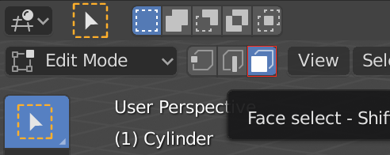
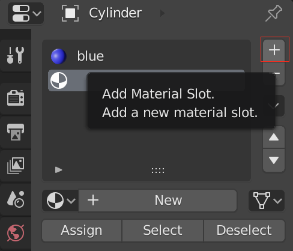
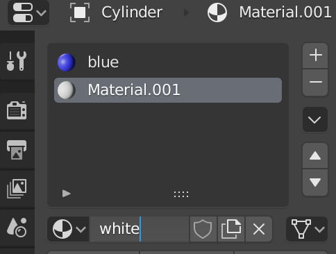
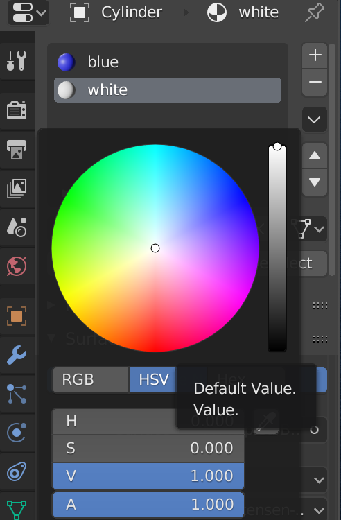
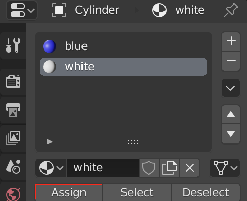

## पट्टियाँ जोड़ें

+ सुनिश्चित करें कि रॉकेट चुना गया है, फिर नीचे के मेनू से **Edit Mode** का चयन करें। यदि आप चाहें, तो आप शॉर्टकट के रूप में <kbd>टैब</kbd> कुंजी का उपयोग कर सकते हैं।

+ नीचे के मेनू से **Face select** टूल पर क्लिक करें।

अब हम पट्टियों के लिए कोई नई सामग्री जोड़ेंगे।

+ दाएँ मेनू पैनल पर **Material** (सामग्री) टैब पर जाएँ, और **+** आइकन पर क्लिक करके कोई दूसरी नई सामग्री जोड़ें।

+ **New** पर क्लिक करें और इस सामग्री को `सफेद` नाम दें।

+ **Diffuse** मेनू के लिए किसी सफेद रंग का चयन करें।

अब आप रॉकेट की आकृतियों पर यह रंग जोड़ सकते हैं।

+ रॉकेट पर उस आकृति को चुनने के लिए राइट-क्लिक करें जिसका रंग आप सफेद करना चाहते हैं।

+ सफेद सामग्री पर क्लिक करें, फिर आकृति का रंग सफेद करने के लिए **Assign** बटन पर क्लिक करें।

अब रंग की जाने वाली अगली आकृति को चुनें और पिछले चरणों को दोहरा कर इस पर सफेद रंग करें। आप किसी आकृति का चयन करके और फिर <kbd>शिफ़्ट</kbd> को दबाए रखकर अन्य आकृतियों का चयन करके एक साथ कई आकृतियों का चयन कर सकते हैं।

+ यह देखने के लिए अपने रॉकेट को प्रस्तुत करें कि यह कैसा दिखता है।