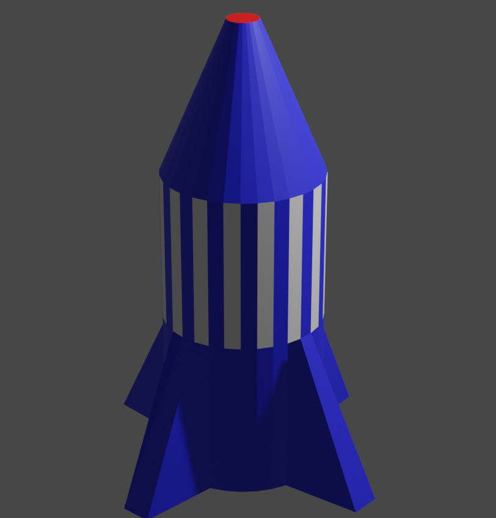

## लाल नाक

आइए नाक पर लाल रंग करें।

+ नाक की आकृति का चयन करने के लिए क्लिक करें।

+ `लाल` नाम की एक नई सामग्री जोड़ें और **Base Color** मेनू के लिए किसी लाल रंग का चयन करें।

+ लाल सामग्री को नाक के लिए निर्धारित करें।

+ अपने नीले रॉकेट को सफेद पट्टियों और लाल नाक के साथ देखने के लिए प्रस्तुत करें।

