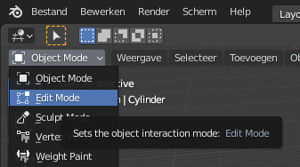

## Basis van de raket

+ Open Blender en sluit het startscherm.

+ Begin met het selecteren van de kubus en druk vervolgens op <kbd>X</kbd> om deze te verwijderen.

+ Ga naar het **Toevoegen** dropdown menu. Voeg een cilinder toe uit de Mesh-sectie.

We gaan de raket maken met deze cilinder. De cilinder wordt de onderkant van de raket en we voegen er dingen bovenop toe om de raket op te bouwen.

+ Schakel over naar **Edit Mode** (bewerkingsmodus) met behulp van het menu linksboven.

Laten we de vinnen maken die de raket tijdens het vliegen stabiliseren.

+ Klik op **Edge select** (rand selecteren) in het onderste menu.

+ Selecteer 4 randen van de onderkant van de cilinder die evenwijdig en loodrecht op elkaar staan. Houd <kbd>Shift</kbd> ingedrukt terwijl je klikt om meer dan één kant te selecteren.

+ Druk op <kbd>S</kbd> en beweeg je muis om de randen naar buiten te slepen en druk op <kbd>Enter</kbd> om te voltooien.

Nu heb je de basis van je raket!