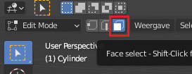
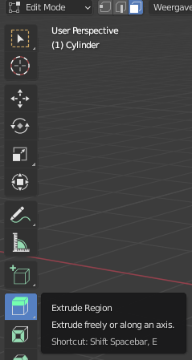

## Lichaam van de raket

Laten we nu het lichaam van de raket maken.

+ Schakel over naar het **Face select** (vlak selecteren) gereedschap.

+ Klik om het bovenvlak van de cilinder te selecteren.

Als je hem omhoog trekt, ziet het er een beetje raar uit. Alles gaat omhoog, en dat is niet wat je wilt.

Je kunt op <kbd>CTRL + Z</kbd> drukken om wijzigingen die je hebt gemaakt ongedaan te maken.

In plaats daarvan gaan we dit vlak uitbouwen.

+ Selecteer **Extrude region** (gebied uitbouwen) uit de lijst met gereedschappen aan de linkerkant, of gebruik desgewenst de sneltoets <kbd>E</kbd>.

+ Trek het gedeelte omhoog om een grotere raket te maken met behulp van de `+`, en klik vervolgens als je tevreden bent.

+ Bouw hetzelfde vlak nogmaals uit om de basis van de neuskegel te vormen. Selecteer **Extrude region** opnieuw in het menu, of gebruik, indien gewenst, de sneltoets <kbd>E</kbd>.

