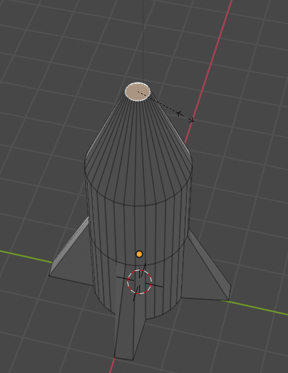

## Neuskegel

De neuskegel zou in een punt uit moeten lopen. Om dit te doen, kun je het gereedschap voor het wijzigen van de grootte gebruiken.

+ Selecteer opnieuw de bovenkant van de raket.

+ Pas de grootte van het vlak aan door op <kbd>S</kbd> te drukken en je muis te bewegen, zodat het meer een neuskegelvorm krijgt. Klik als je de vorm hebt die je wilt.

+ Render de afbeelding door op <kbd>F12</kbd> (<kbd>FN + F12</kbd> als je een Mac gebruikt) te drukken en kijk hoe de raket eruit ziet.

Het ziet er misschien een beetje groot uit, maar je kunt de grootte van de hele raket wijzigen.

+ Druk op <kbd>ESC</kbd> om de renderweergave te verlaten.

+ Schakel terug naar **Object Mode** met behulp van het menu linksboven en selecteer de raket door erop te klikken.

+ Druk op de <kbd>S</kbd> toets om de grootte te wijzigen en vervolgens de raket te verkleinen. Klik wanneer je tevreden bent met de grootte.

+ Render opnieuw door op <kbd>F12</kbd> (of <kbd>FN + F12</kbd>) te drukken om er zeker van te zijn dat de raket de juiste grootte heeft.

