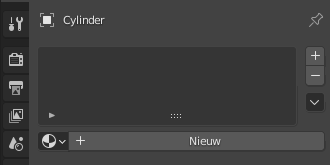
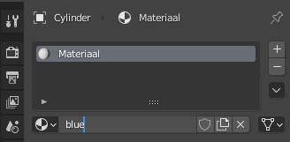
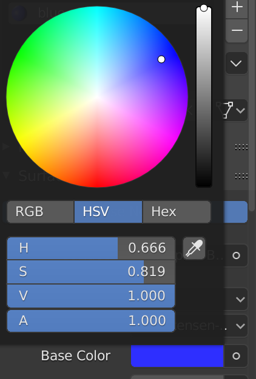
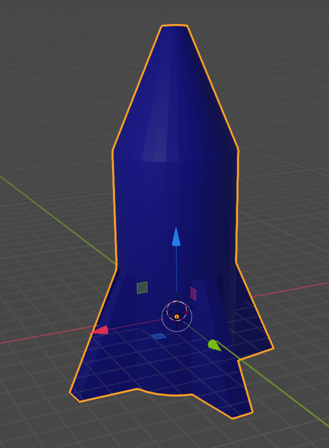

## Kleur de raket

Eerst geven we de raket een blauwe basiskleur.

+ Selecteer de raket.

+ Ga naar het tabblad **Material Properties** (materiaaleigenschappen) in het rechtermenu.

+ Voeg een nieuw materiaal toe door op **Nieuw** te klikken.

+ Noem het materiaal `blue` (blauw).

+ Selecteer een blauwe kleur uit het **Base Color** (basiskleur) menu om je raket blauw te kleuren.

