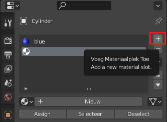
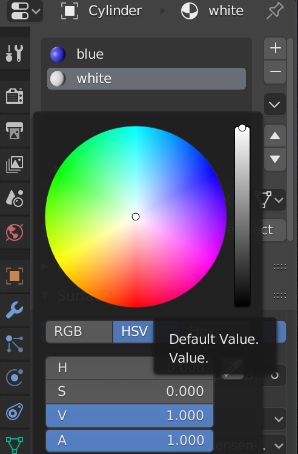

## Voeg strepen toe

+ Zorg ervoor dat de raket is geselecteerd en selecteer vervolgens **Edit Mode** in het menu in de linkerbovenhoek. Als je wilt, kun je de <kbd>Tab</kbd> toets als snelkoppeling gebruiken.

+ Klik op het **Face select** gereedschap in het menu vlak naast het edit mode menu.

Nu gaan we een nieuw materiaal voor de strepen toevoegen.

+ Ga naar het tabblad **Material Properties** in het rechtermenu en voeg nog een nieuw materiaal toe door op het pictogram **+** te klikken.

+ Klik op **Nieuw** en noem het materiaal `white` (wit).

+ Selecteer een witte kleur in het menu **Base Color**.

Nu kun je deze kleur toevoegen aan de vlakken van de raket.

+ Klik om een vlak op de raket te selecteren dat je wit wilt kleuren.

+ Klik op het witte materiaal en klik vervolgens op de **Assign** (toewijzen) knop om het vlak wit te kleuren.

Selecteer nu het volgende vlak dat je wilt kleuren en geef het de witte kleur door de vorige stappen te herhalen. Je kunt meerdere vlakken tegelijk selecteren door een vlak te selecteren en vervolgens <kbd>Shift</kbd> ingedrukt te houden terwijl je de andere vlakken selecteert.

+ Render je raket om te zien hoe hij eruit ziet.