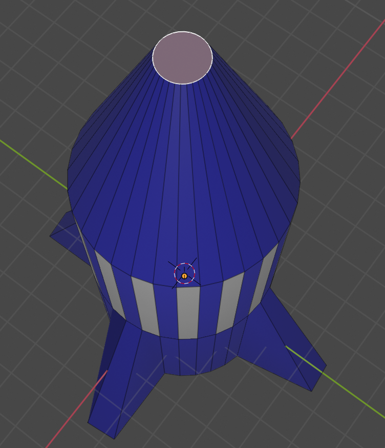
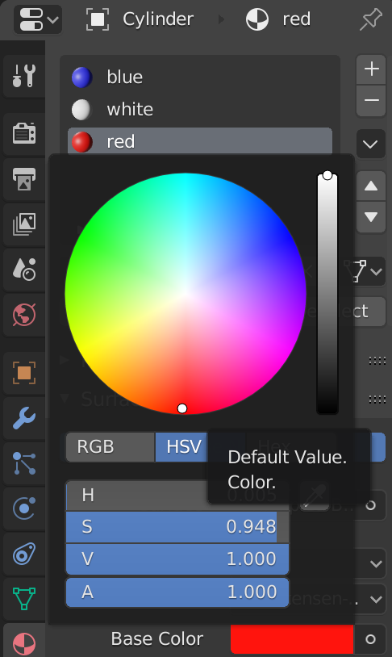

## Rode neus

Laten we de neus rood kleuren.

+ Klik om het vlak van de neus te selecteren.

+ Voeg een nieuw materiaal toe met de naam `red` (rood) en selecteer een rode kleur uit het menu **Base Color**.

+ Wijs het rode materiaal toe aan de neus.

+ Render om je blauwe raket te zien met witte strepen en een rode neus.

